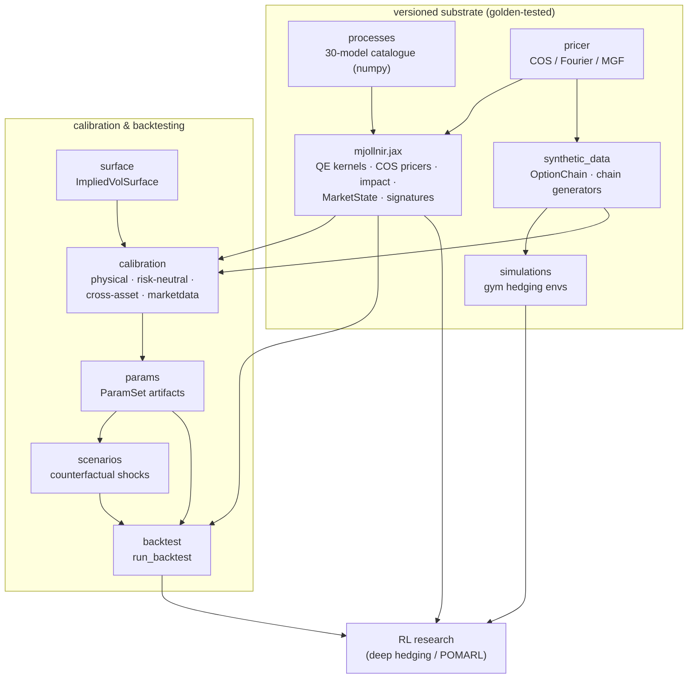

# Architecture

One dependency direction, two consumption modes. Everything inside the
"versioned substrate" boundary is golden-tested: changing its behaviour is a
version bump, never a silent drift.

## The two modes

**Mode 1 — RL substrate.** Experiments pin a version of `mjollnir.jax`:
jittable, batchable, differentiable primitives with explicit PRNG keys.
Golden-key tests freeze the numerics; breaking them is a release event.

**Mode 2 — calibration → artifact → counterfactual → backtest.** Market
data (or synthetic chains) become an `ImpliedVolSurface`, calibrate to a
hash-verified `ParamSet`, optionally pass through a `Scenario`, and drive
`run_backtest` — every result attributable to a specific parameter artifact.
